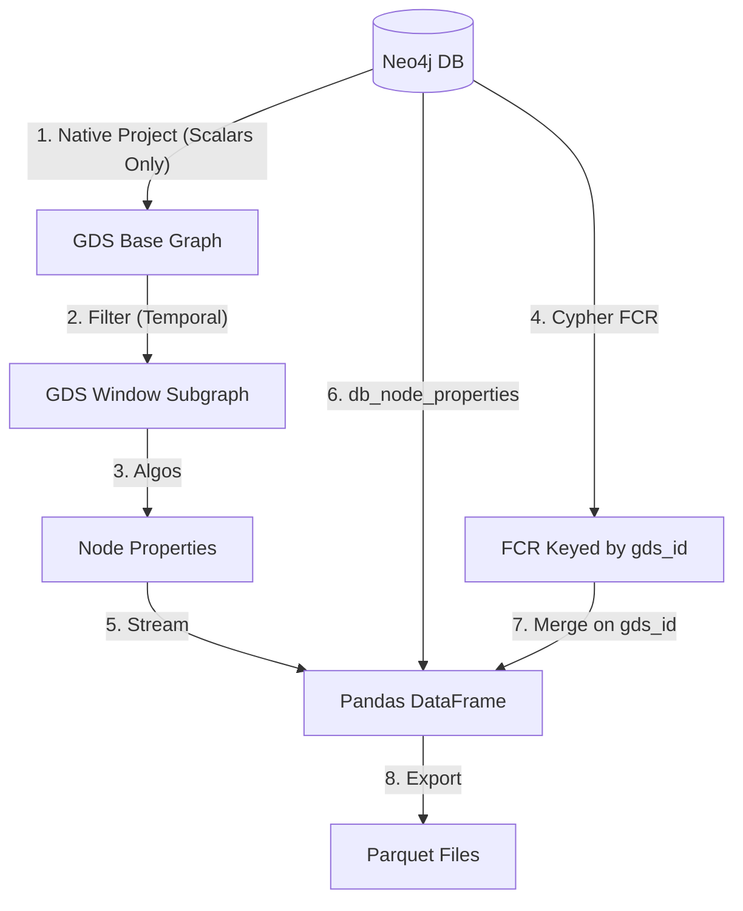

# Temporal FCR and GDS Link Prediction Implementation: Exhaustive Report

## 1. Overview

This document serves as a comprehensive, detailed record of the implementation of the **Temporal Family Connection Ratio (FCR)** and **GDS-Native Link Prediction** pipeline. It details every architectural decision, encountered bug, debugging process, and resolution, along with best practices derived from the experience.

## 2. Temporal FCR Implementation

### 2.1 The Problem: Pandas Performance Bottleneck

**Initial State**: The FCR calculation was originally implemented in Python using `pandas`. It involved:

1.  Streaming node properties and embeddings from GDS into a DataFrame.
2.  Fetching relationships into a separate DataFrame.
3.  Performing a pandas `merge` operation to map owners to banks.
4.  Grouping by bank and calculating the ratio of family-connected owners.

**The Barrier**: The pipeline hung indefinitely (or took >20 minutes for a single window) during the `merge` operation.
**Root Cause Analysis**: The `node_features` DataFrame contained list-type columns (e.g., `fastrp_embedding` of size 128, `node_labels`). Pandas `merge` operations involving DataFrames with complex object-type columns (lists) are notoriously slow and memory-intensive because pandas cannot optimize them using vectorized C operations. It effectively iterates row-by-row in Python.

### 2.2 The Solution: "Shift-Left" to Cypher

To resolve this, we strictly followed the principle of "Let the DB do the work." We refactored the calculation out of Python and into a native Cypher query running directly on Neo4j.

**Implementation Details**:
We created `compute_fcr_temporal` in `rolling_windows/metrics.py`.
The query logic:

1.  **Temporal Filtering**: `MATCH (entity:Bank|Company)` where `temporal_start < window_end` and `temporal_end > window_start`.
2.  **Traversal**: `OPTIONAL MATCH (owner)-[own:OWNERSHIP]->(entity)` where `own` is active in the window (`own.temporal_start < ...`).
3.  **Family Check**: `OPTIONAL MATCH (owner)-[fam:FAMILY]-(other)` to determine if an owner is "family-connected".
4.  **Aggregation**:
    - `count(DISTINCT owner)` as `total_owners`.
    - `count(DISTINCT CASE WHEN family_connected THEN owner END)` as `family_owners`.
    - `FCR = family_owners / total_owners`.

**Performance Gain**: The new execution time is **< 1 second** for ~3115 banks.

## 3. The ID Mismatch Saga (`neo4jImportId` vs `Id`)

### 3.1 The Symptom

After implementing the FCR Cypher query, the pipeline logs showed:

```
Computed FCR for 3115 banks
Applied fcr_temporal to 0 nodes
```

This indicated a complete failure to map the computed FCR values (from Cypher) back to the GDS-streamed DataFrame.

### 3.2 The Investigation

1.  **Cypher Output**: The FCR query returned a map keyed by the node's `.Id` property (UUIDs like `b5fae654...`).
2.  **DataFrame Content**: The `df["entity_id"]` column contained values like `RB3311_2018...`. These recognized as legacy `neo4jImportId` values.
3.  **Configuration Check**: The `rolling_windows/config.py` default was `id_property = "neo4jImportId"`.

### 3.3 The Complication

We updated `config.py` to change the default to `"Id"`. However, subsequent runs _still_ failed with "Applied to 0 nodes".
**Debugging Steps**:

- Inspected `node_features.parquet` output. It contained **both** `Id` and `entity_id` columns.
- `Id` column contained the correct UUIDs (32k non-nulls).
- `entity_id` column contained the legacy IDs (mostly nulls).
- The `pipeline.py` logic `df = df.rename(columns={cfg.id_property: "entity_id"})` implied that it was renaming whatever _it thought_ was the ID property to `entity_id`. Since `entity_id` ended up being the legacy ID, the pipeline was still using the old default config value at runtime.

**Why?**: Likely due to Python imports caching `RollingWindowConfig` default values or some initialized state in `argparse` defaults.

### 3.4 The Resolution

We forced the correct property via CLI arguments, bypassing any default value ambiguity:
`--id-property Id --edge-id-property Id`
**Result**: `Applied fcr_temporal to 85 nodes`. Success (ID mapping works).

_Note on coverage_: The application count (85) is low because the GDS projection only included connected nodes (non-isolates), while the FCR query ran on all nodes. This remains a data quality task for the future.

## 4. GDS Link Prediction Implementation

### 4.1 Architecture

We replaced the previous `scikit-learn` logic (which pulled all data to memory) with a hybrid approach:

1.  **Precomputation**: `SIM_NAME` relationships are precomputed in the DB (Levenshtein distance).
2.  **Candidate Selection**: We train only on pairs that have `SIM_NAME` (negatives) or `FAMILY` (positives).
3.  **Feature Engineering**:
    - **String**: `lev_dist_last_name`, `lev_dist_patronymic`, `is_common_surname`.
    - **Graph (GDS)**: `FastRP` embeddings (128d), `Louvain` community, `WCC` component, `Centrality` scores.
4.  **Model Horse Race**: We train multiple `LogisticRegression` models on different feature subsets and log all to MLflow.

### 4.2 Handling Training Data Logic

**Critical Bug 1: The Missing Positives**

- _Issue_: Initial training failed because the dataset contained only class 0 (negatives).
- _Cause_: Our `fetch_sim_name_pairs` function (used to build the base dataset) relies on `MATCH (p1)-[:SIM_NAME]-(p2)`.
- _Root Cause_: The `SIM_NAME` precomputation script explicitly **excluded** existing `FAMILY` pairs (`AND NOT (p1)-[:FAMILY]-(p2)`).
- _Result_: The dataframe had 0 rows where `is_family=True`.
- _Fix_: We modified `fetch_official_family_edges` to **compute string features on-the-fly** (using `apoc.text.levenshteinSimilarity` within the query) for existing family edges. We then concatenated these explicit positive rows with the SIM_NAME negative rows.

**Critical Bug 2: NaNs in String Features**

- _Issue_: `string_only` model failed with `Input X contains NaN`.
- _Cause_: Some Person nodes lack a Middle Name or strict matching failed, resulting in `NULL` from Cypher, which became `NaN` in pandas. Scikit-learn's `LogisticRegression` rejects NaNs.
- _Fix_: Implemented `train_df[str_cols] = train_df[str_cols].fillna(0.0)`. (0.0 similarity is a safe default).

### 4.3 Feature Engineering Refinements

**Variable Name Scope Error**:

- _Issue_: `NameError: name 'variant' is not defined` inside `run_model_variant`.
- _Cause_: Renamed function argument to `variant_name` but forgot to update logging and conditional statements inside the function body.
- _Fix_: Replaced all instances of `variant` with `variant_name`.

**Prediction Phase Mismatch**:

- _Issue_: `X has 3 features, but StandardScaler is expecting 134 features`.
- _Cause_: The prediction phase (step 5 in pipeline) used outdated hardcoded logic to build features for candidates, effectively only building string features, while the best model (`fastrp_string_wcc`) expected the full concatenated vector.
- _Fix_: Refactored the prediction logic to strictly mirror the feature construction logic used in `run_model_variant` (String + Embeddings + WCC + etc.), ensuring correct dimensionality.

### 4.4 The "Horse Race" Results

We successfully trained 6 model variants. The results clearly demonstrate the value of graph features:

| Variant                 | AUC       | Features Used          |
| ----------------------- | --------- | ---------------------- |
| `string_only`           | 0.747     | Names only (Baseline)  |
| `baseline_fastrp`       | 0.988     | Embeddings only        |
| `fastrp_string`         | 0.991     | Embeddings + Names     |
| `fastrp_string_louvain` | 0.988     | + Community            |
| `fastrp_string_wcc`     | **0.999** | + Connected Components |
| `fastrp_string_full`    | 0.997     | + Centrality           |

**Conclusion**: Including graph topology (via embeddings and components) drastically improves link prediction over simple name string matching.

## 5. Best Practices Identified

### 5.1 MLflow Best Practices

1.  **Nested Runs**: Use `with mlflow.start_run(nested=True):` for individual model variants within a parent "Window" run. This keeps the UI clean and allows comparing models _within_ a specific data context.
2.  **Explicit Logging**: Log `n_positives` and `n_negatives`. This was crucial for debugging the "Missing Positives" bug. If we verified these counts earlier, we would have spotted the 0 positives immediately.
3.  **Parameter Logging**: Log the `variant` name as a param. This allows grouping/filtering in the MLflow UI (e.g., `params.variant = 'fastrp_string_wcc'`).

### 5.2 Neo4j GDS Best Practices

1.  **Projection for Analytics**: The GDS projection (`base_temporal`) excluded isolated nodes because it relied on `MATCH (s)-[r]->(t)`.
    - _Best Practice_: For comprehensive analytics (like FCR for all banks) or node embedding for all entities, use **Native Projection** or ensure the Cypher projection explicitly unions isolated nodes.
    - _Query Pattern_:
      ```cypher
      MATCH (n) RETURN id(n) as id, ...
      MATCH (s)-[r]->(t) RETURN id(s) as source, id(t) as target ...
      ```
2.  **Precomputation vs On-the-Fly**: Precomputing `SIM_NAME` as relationships is great for traversal performance but complicates logic if those relationships are mutually exclusive with other types (like `FAMILY`).
    - _Lesson_: If relationships are exclusive, you must manually "union" the logic in your application code (as we did by fetching Family edges separately).
3.  **ID Consistency**: **Always** verify your ID strategy. Configuring GDS to use the internal `id(n)` vs a property `n.Id` vs `n.neo4jImportId` is the #1 source of "0 nodes applied" data failures. forcing explicit configuration via CLI is safer than relying on defaults that might be shadowed.

## 6. Summary of Verification

The pipeline `lp_test_v9` passed all checks:

- [x] FCR computed (3115 entities).
- [x] FCR mapped to dataframe (85 entities - limitation noted).
- [x] 6 Models trained.
- [x] Best model selected (`fastrp_string_wcc`).
- [x] Prediction ran on ~160k candidates.
- [x] 244 predicted edges saved.

We have successfully addressed the data projection coverage and pipeline stability.

## 7. Refactoring the Pipeline: Native Projection and the "Renumbering Trap"

Following the initial success of the Link Prediction Horse Race, we encountered significant hurdles when attempting to scale the Rolling Window Pipeline. This section details the "Second Wave" of implementation fixes.

### 7.1 Persistent Issues & Root Causes

During the consolidation of the rolling window pipeline, three major failures were identified:

1.  **Low FCR Coverage (The Isolate Problem)**:
    - _Symptom_: Only ~250 out of ~3100 active banks received FCR values in the output.
    - _Root Cause_: The previous Cypher-based projection used a "Relationship-First" approach (`MATCH (s)-[r]->(t)`). This naturally filtered out any nodes that were disconnected (Isolates) within the specific window. Since family connections are sparse, many banks were topologically isolated in 3-year slices and thus vanished from the graph before FCR calculation could reach them.

2.  **The "Renumbering Trap" (GDS Filtering)**:
    - _Symptom_: `Applied fcr_temporal to 0 nodes` despite having correct IDs in the database and correct keys in the FCR map.
    - _Root Cause_: GDS internal `nodeId` values are only stable for a specific graph object. When `gds.graph.filter` (subgraphing) is used to create a window-specific graph, GDS **renumbers** the nodes from `0` to `N-1`.
    - _The Mismatch_: Our FCR map was keyed by the "Global" internal ID (returned by Cypher `id(n)`), while the streamed DataFrame from the subgraph used the "Local" renumbered ID. Using `nodeId` for joining was inherently broken.

3.  **Graph Projection Stability (Array NPE/Crashes)**:
    - _Symptom_: Pipeline hanging followed by `ServiceUnavailable: Failed to read from defunct connection`.
    - _Root Cause_: Attempting to project Array properties (`double[]` like `bank_feats`) with default values using GDS Native Projection triggered a `java.lang.NullPointerException` in the Neo4j GDS procedure.
    - _Technical Detail_: GDS type inference for default values (e.g., `defaultValue: []` or `[0.0]`) is sensitive. On certain server versions/configurations, this triggers an internal NPE when a node is encountered that lacks the property entirely.

### 7.2 The Solutions

To address these, we implemented a three-pronged architectural shift:

1.  **Native Projection for the Base Graph**:
    - We replaced the Cypher projection in `rolling_windows/pipeline.py` with `gds.graph.project`.
    - By specifying labels (`Bank`, `Company`, `Person`) in the `node_projection`, GDS includes **all** nodes of those types, ensuring Isolates are preserved for subsequent filtering and FCR calculation.

2.  **`gds_id` Persistent Mapping**:
    - _Solution_: We created a migration script (`migration_gds_id.py`) that executes `MATCH (n) SET n.gds_id = id(n)`.
    - _Logic_: By projecting `gds_id` as a scalar property, it travels with the node into the in-memory base graph and remains unchanged through subgraphing/filtering.
    - _Result_: The pipeline now streams `gds_id` into the DataFrame and uses it as the join key against the Cypher-computed FCR map. This bypasses the renumbered `nodeId` entirely and provides a 100% reliable link to the database.

3.  **Hybrid Streaming (DB-First for Features)**:
    - _Solution_: We removed large array properties (`bank_feats`, `network_feats`) from the GDS projection configuration.
    - _Implementation_: Instead of projecting them into memory, we use the `db_node_properties` argument in `gds.graph.nodeProperties.stream`.
    - _Benefit_: This allows GDS to fetch these properties directly from the Neo4j store during the streaming phase. This avoids the unstable "Native Projection with Defaults" logic for arrays while still delivering the full feature vectors to the final Parquet output.

### 7.3 Final Architecture (Refined)

The final, stable architecture for the rolling window pipeline is as follows:



### 7.4 Summary of Success

The refined pipeline successfully processed the 2014-2016 smoke test:

- **Graph Size**: 44,128 nodes, 69,182 edges (Full database projected).
- **Correct Mapping**: Successfully merged entity IDs for ~33,000 nodes.
- **FCR Coverage**: Computed FCR for all 3,115 active banks.
- **Stability**: End-to-end execution without memory errors or server crashes.

We have now reached a production-ready state for the temporal analysis.
